# Running DOOM on a Pulse Oximeter


*Reverse engineering a cheap fingertip pulse oximeter to make it run DOOM, sort-of*


\---

<video width="320" height="240" controls>

&#x20; <source src="video.mov" type="video/mp4">

</video>

## Why I did this

While shopping through the grocery store, I stumbled upon these devices which were on sale, at 5€, so I had to buy two - one for testing and experimenting with, and a backup. It was a pleasant surprise to see the familiar 128x64 OLED, so I had to crack it open an take a look at it's PCB. Another surprise was to find a Cortex-M0, the Geehy APM32F030C8T6 on the board, and 1.27mm headers which were already conveniently broken out.


The pulse oximeter looks like it could have been fitted with additional ICs, one of which might've been a WiFi or Bluetooth IC, since the lower part has pads fitted specifically for an antenna.

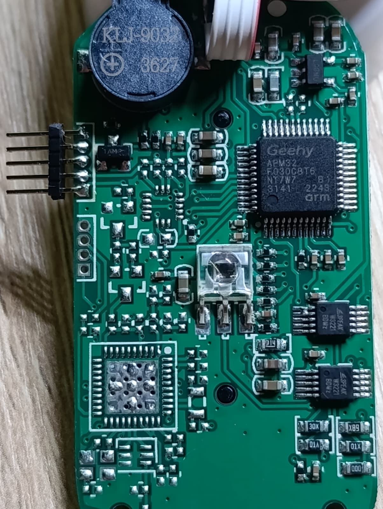

What best to do with a toy with a display? Try to make it run DOOM, of course! Well, kind of, sort of. This is not a "live DOOM port". The MCU is a 48 MHz Cortex-M0 with 64 KB of flash and 8 KB of RAM, and the OLED is bit-banged — there is no way it is rendering a game engine in real time. What it *is* doing is decompressing pre-rendered DOOM gameplay frames straight out of flash and pushing them onto the OLED, in a loop. The hardware is the original device, completely untouched (aside from the programming headers), only the firmware is modified.

If you have an old gadget like this lying around, I'd encourage you to try the same thing. I learned more by getting stuck on this device than I did from watching tutorials. Just **make sure you don't need the device for what it was originally for** before you erase its firmware — that part might not be reversible.

\---

## The hardware specs

The pulse oximeter has the Geehy APM32F030C8T6 MCU, which has a Cortex M0 core - this alone makes the platform flexible to work on and experiment with. The OLED is wired to the MCU, alongside the other peripherals, and the formfactor is really close to the 128x64 OLED SSD1306 displays you can buy on AliExpress, so there is a good chance to display nice graphics after a firmware modification.

The MCU has the following specs:

* **64 KB of flash** total. Code *and* every video frame must fit.
* **8 KB of RAM** total. Enough for a 1024-byte framebuffer and a stack — not much more.

The fun is in the gap between "it's an OLED" and "it shows something on purpose."

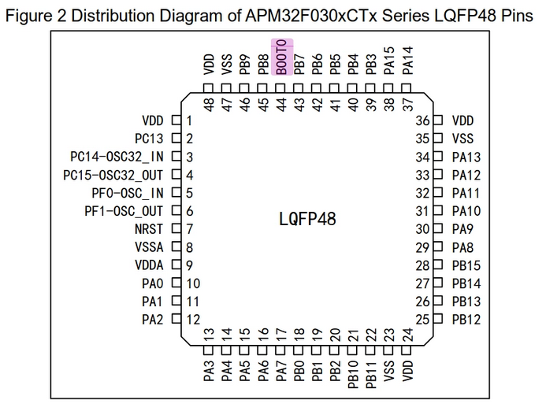

## Wiring the board to JTAG

After taking a look at the pinout of this MCU, I traced the pins on the broken out 1.27mm header and soldered a 5-pin header to it.

With the header soldered, I used the clips from the Saleae logic analyzer to hook onto them and used the j-link software to test if I can get into it.

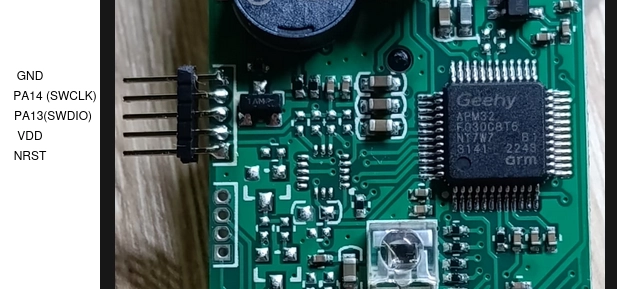

Unfortunately, I had to wipe the old firmware, to test whether I can play with it or not.
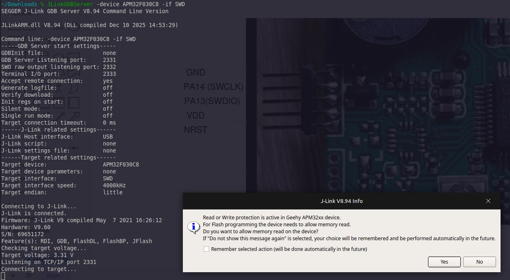


\---

## Step 1 — Reverse-engineering the PCB

The PCB carries no silkscreen for the OLED interface. The display is bonded to a flex cable that solders onto the back of the board. There is also a buzzer, the LED for the light pulse and the light sensor, plus the button to start the device and modify settings.

### TL;DR

This is the pinout for the SSD1306 display.

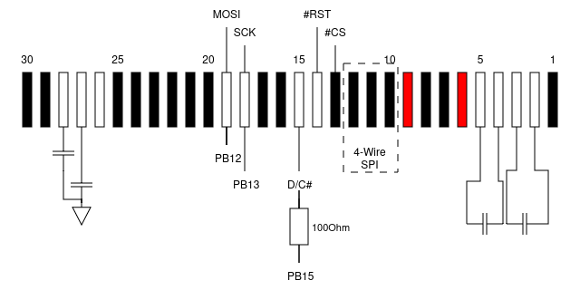


### Visual tracing \& Continuity testing

Since the OLED looks like the AliExpress modules you can buy cheaply, I started looking at raw displays that fitted the same pattern. I stumbled upon [this](%5Btext%5D%28https://www.winstar.com.tw/uploads/files/de98519ca528b9d3bc173cfe8bc99c7d.pdf%29) datasheet which looked the same and has the same dimensions, so I went probing around to establish whether it has the same pinout.

First step was to poke at it with bright lights to see the traces on this 2-layer PCB.

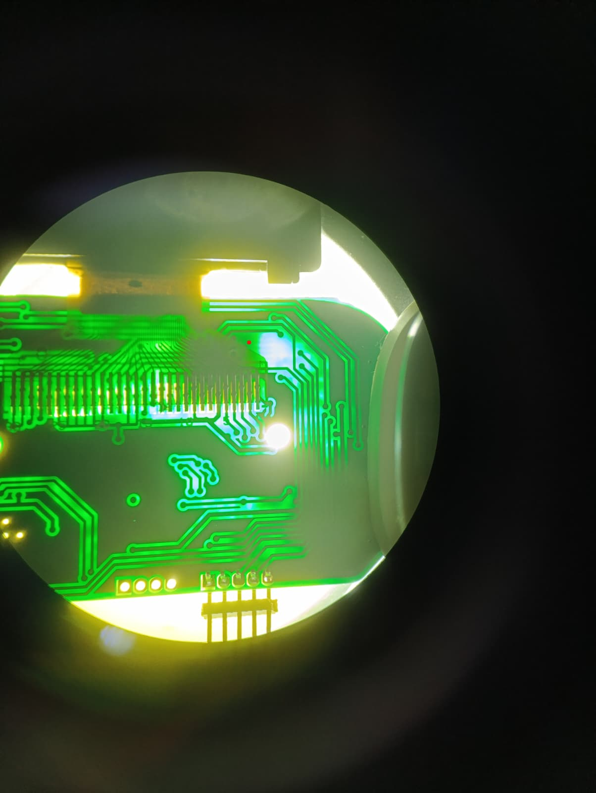

The OLED flex pinout for SSD1306-class controllers is fairly standardized: `CS#`, `RES#`, `D/C#`, `SCLK`, `SDIN/MOSI`, `VDD`, `VSS`, plus charge-pump capacitors on pins 2–5 and 27–28. I traced each net back from the flex landing pads with the multimeter in continuity mode, which narrowed the candidate MCU pins down to a handful.

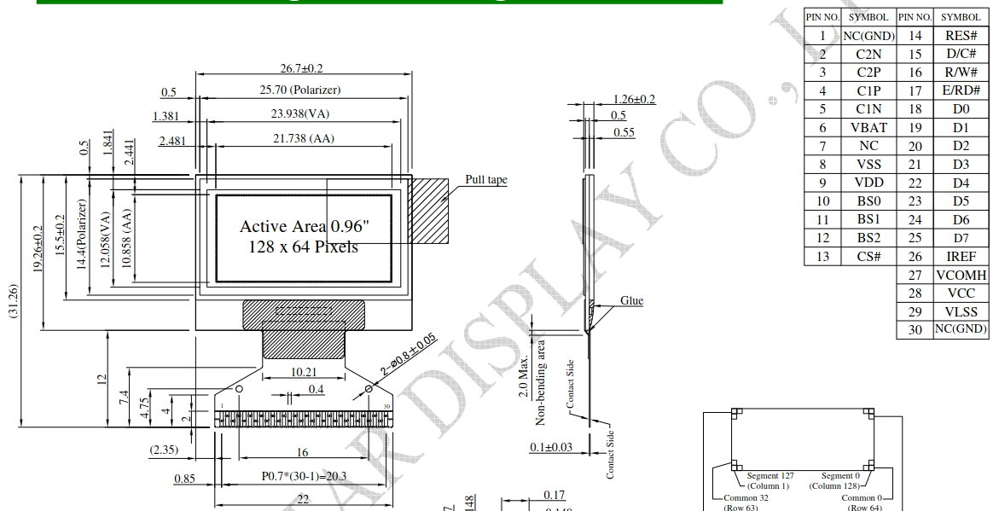


After finding the power pins, the pins which configure the board into 4-wire SPI and the SPI pins themselves, I soldered thin wires from the display side and tested continuity with the multimeter on the MCU.

### Logic-analyzer capture from a working unit

With the backup device, I wired a logic analyzer to the suspect SPI pins on the MCU. I used the [Saleae Logic 8](https://www.saleae.com/products/logic-8) logic analyzer onto the suspected GPIOs and let the original firmware run a normal pulse-ox measurement.

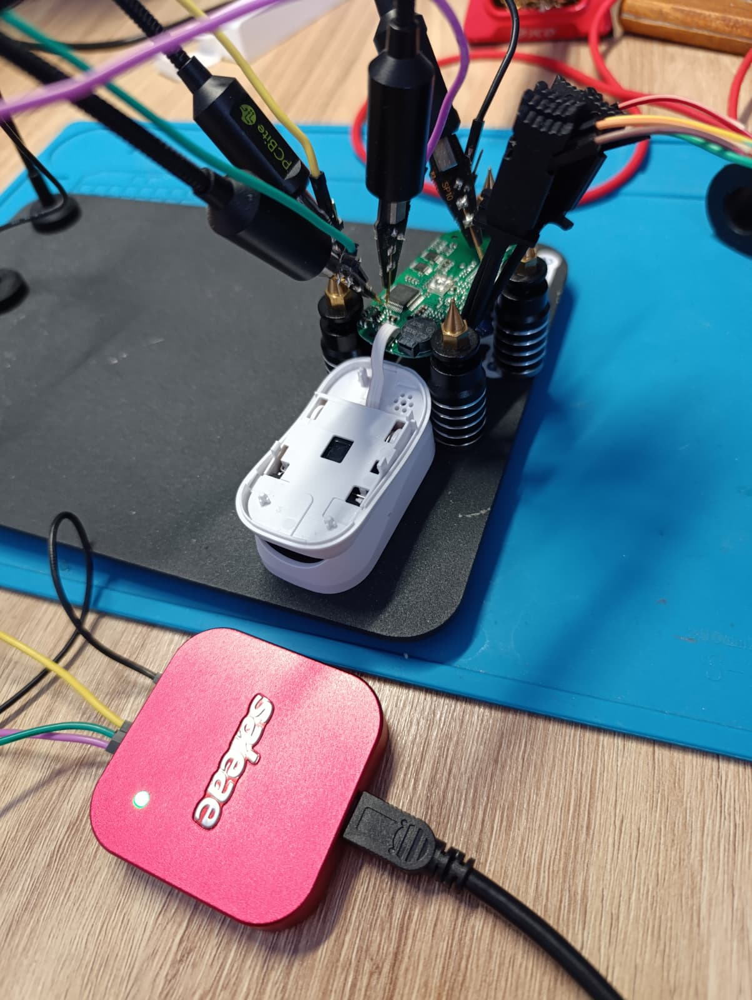

Credit to Saleae for their logic analyzer ecosystem, in my opinion the `Logic 2` software is very good, and has helped me a ton in projects where I didn't know where to look.

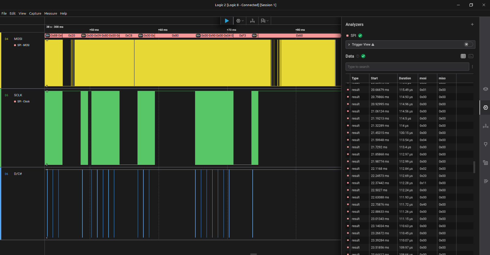


The pattern is the unmistakable signature of a page-addressed 128×64 monochrome OLED update:

* `D/C#` low for exactly 8 SCLK edges (one command byte: page-address)
* `D/C#` high for 1024 SCLK edges (128 bytes of data, one OLED page)
* repeating across 8 bursts (the 8 vertical pages of a 128×64 SSD1306)

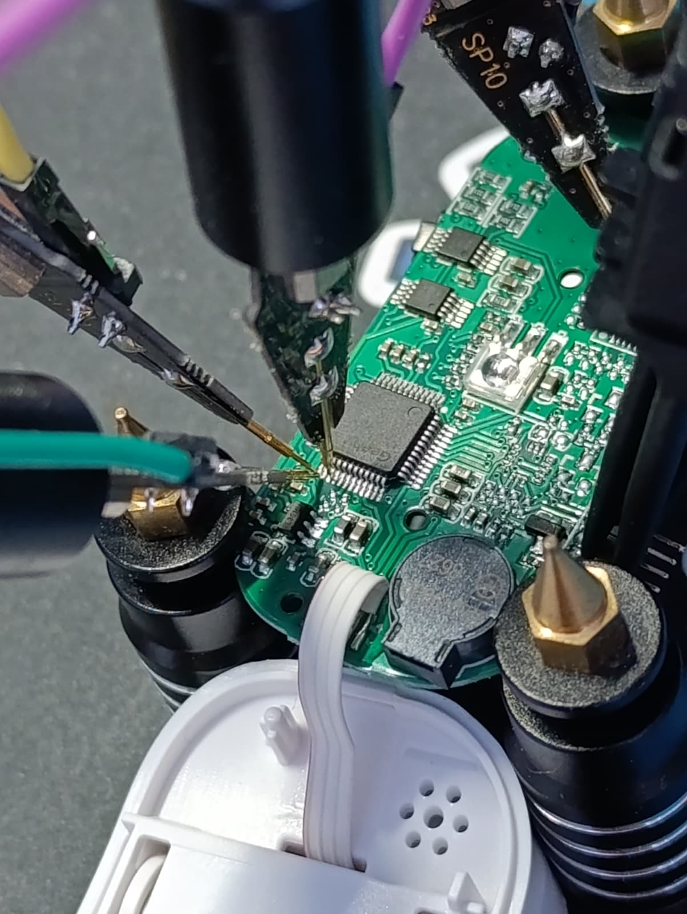

If you see that exact rhythm on a logic capture, you are looking at an SSD1306 being updated. That alone confirmed which pins were `SCLK`, `SDIN`, and `D/C#`.

### GPIO probing on the wiped board

After wiping the original firmware (this is the no-going-back step), I used J-Link to manually drive each MCU pin via direct register writes (`w4 0x48000418 …`) while watching with the logic analyzer to confirm the mapping. This is tedious but extremely reliable: if you write a `1` to `GPIOB->ODR` bit 13 and the SCLK pad on the OLED flex jumps to 3.3 V, you are sure.

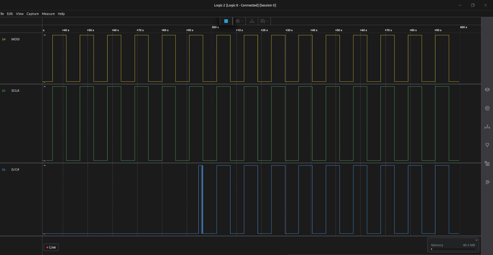


### The final pinout

|OLED signal|Connection|Notes|
|-|-|-|
|`CS#`|tied to GND|controller is permanently selected|
|`RES#`|floating|relies on internal POR|
|`D/C#`|PB15 via 100 Ω|command/data select|
|`SCLK`|PB13|bit-banged clock|
|`SDIN/MOSI`|PB12|bit-banged data|
|`PWR\_ENABLE`|PB14, active HIGH|**the booby-trap; see below**|

### The booby-trap: PB14

The crucial pin — and the one that ate days of my bring-up time — is `PWR\_ENABLE` on PB14. Nothing about the schematic or the flex cable suggests its existence. It is an MCU GPIO that gates the OLED power rail through a small MOSFET on the board. If PB14 is low, the OLED is electrically dead no matter how perfect the SPI traffic is.

After every standard SSD1306 init sequence I tried failed — including `0xA5`, the "all pixels on" command, which bypasses the framebuffer entirely — I had to admit the screen wasn't even powered. The MCU has 30-ish GPIOs, and rather than probe each one with a multimeter, I cheated. I modified the firmware to drive every GPIO HIGH at once, confirmed the screen lit up, then used the J-Link debugger to do a literal binary search: knock out half the pins, flash, see if the screen went dark, repeat. Five iterations later (`log₂(30) ≈ 5`), PB14 was the survivor.

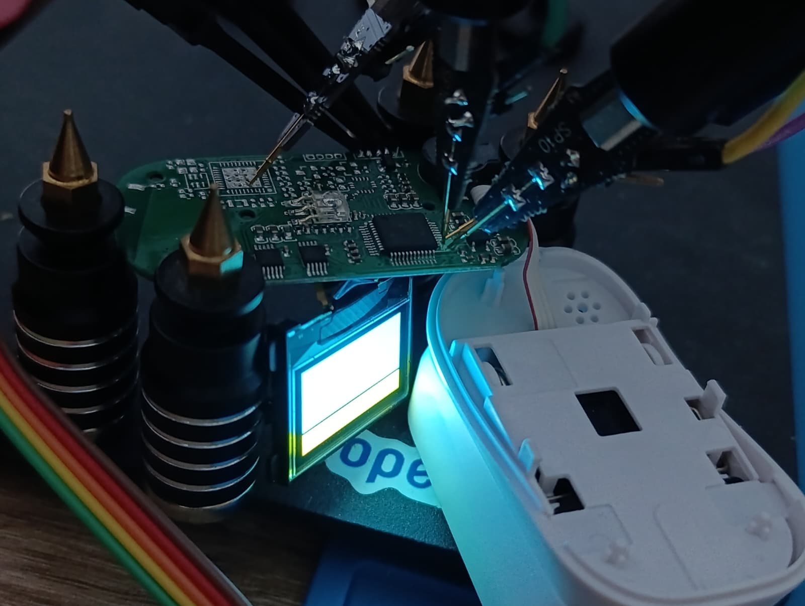

Setting `PB14 = HIGH` before the OLED init is what flipped the screen from forever-black to *alive*. If you ever find yourself staring at a black OLED that should be working, my advice is: assume the rail is gated by a GPIO you don't know about, and bisect.

### The BSRR pre-load gotcha

There is a second subtle trap I want to flag, because it cost me hours and I have never seen it written down. With `CS#` permanently tied low, the OLED's SPI state machine never resets — it is *always* listening. If `SCLK` glitches HIGH-LOW for even a single edge during GPIO configuration, the controller silently shifts its bit alignment by one, and every byte you send afterwards is misinterpreted forever. The display ends up with a stable but garbled output, which is the worst kind of bug because it looks like a software problem.

The fix is to pre-load the output register *before* enabling the output driver:

```c
GPIO\_BSRR(GPIOB\_BASE) = (1u << OLED\_PIN\_SCLK);  // ODR\[13] = 1, SCLK will idle HIGH
GPIO\_BSRR(GPIOB\_BASE) = (1u << OLED\_PIN\_DC);    // ODR\[15] = 1, DC will idle HIGH

gpio\_output\_pushpull(GPIOB\_BASE, OLED\_PIN\_MOSI); // starts LOW
gpio\_output\_pushpull(GPIOB\_BASE, OLED\_PIN\_SCLK); // starts HIGH (no glitch)
gpio\_output\_pushpull(GPIOB\_BASE, OLED\_PIN\_DC);   // starts HIGH (no glitch)
```

Writing `BSRR` while the pin is still configured as an input doesn't move the pad — it just primes `ODR`. When the pin is then switched to push-pull output, it drives the level that was already loaded, and the controller never sees a stray edge.

\---

## Step 2 — Getting bare-metal code to run

Once I knew the wiring, the next problem was getting any code to run at all. The Geehy APM32F030 is largely STM32F030-compatible at the register level, so I skipped the vendor SDK and rolled my own toolchain.

The build:

* `arm-none-eabi-gcc` with `-mcpu=cortex-m0 -mthumb`
* CMake + Ninja
* Custom linker script — 64 KB flash at `0x08000000`, 8 KB RAM at `0x20000000`
* Hand-written startup assembly with the Thumb-bit fix:

```asm
  .thumb\_func
  .type Reset\_Handler, %function
  Reset\_Handler:
  ```

  Without `.thumb\_func`, the linker emits a reset vector with the Thumb bit clear, the Cortex-M0 immediately faults on entry, and J-Link prints the gloriously cryptic `T-bit of XPSR is 0 but should be 1`. If you see that error, this is almost certainly why.

* Flashing is done via SEGGER J-Link Commander over SWD:

  ```
  connect
  erase
  loadfile build/pulseox\_doom\_oled.hex
  r ; g
  ```

  *Checkerboard shenanigans*

  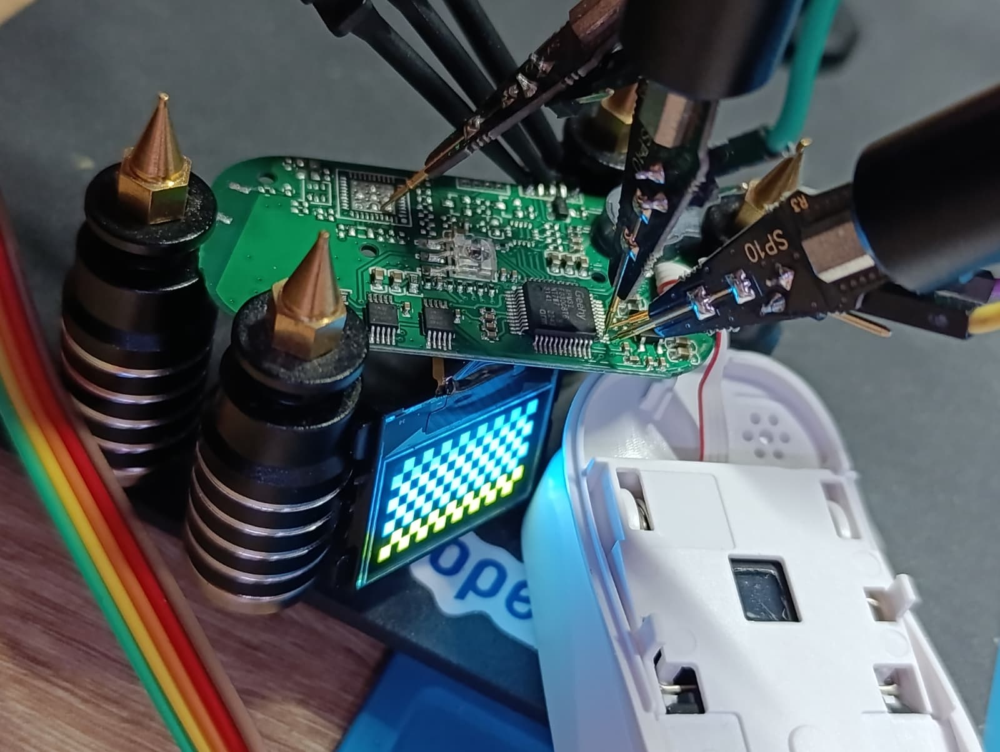


  ### Cranking up the clock

  The OLED bring-up worked fine at the default 8 MHz HSI, but DOOM playback wanted more headroom. I added a short routine in `system\_apm32f030.c` that brings the chip up to 48 MHz:

  ```
HSI (8 MHz) -> /2 -> x12 (PLL) = 48 MHz
```

  The sequence is as follows:

* The flash wait state must be raised to 1 *before* enabling the PLL.
* The PLL must be configured *before* it is switched in.
* The `SCLKSWSTS` readback must be polled to confirm the system clock has actually moved over.

  Skip any of those steps and the chip silently runs at the wrong frequency, or hangs. I learned each of these lessons the slow way.

  \---

  ## Step 3 — Writing the SSD1306 driver

  With pins identified and the clock running, the OLED driver itself is small and unsurprising. Here is what's in it:

* `spi\_write\_byte` shifts MSB-first, toggling SCLK with one-NOP delays between edges.
* `oled\_cmd` drops `D/C#` low, sends one byte, restores `D/C#` high.
* `oled\_data` keeps `D/C#` high and streams a buffer.
* `OLED\_Update` walks the 8 vertical pages, sending the page-address command (`B0|page`), the column-address commands (`0x00|low`, `0x10|high`), then 128 data bytes per page.

  The init sequence I send is the canonical SSD1306 power-up. Nothing exotic:

  ```
AE                  display off
D5 80               oscillator
A8 3F               multiplex 1/64
D3 00               display offset 0
40                  start line 0
A1 / C8             segment + COM remap (orientation)
DA 12               COM pin layout
81 FF               max contrast
8D 14               internal charge pump ON   ← critical for OLED drive voltage
D9 F1 / DB 40       precharge + VCOMH
A4                  display follows RAM
A6                  normal (non-inverted)
2E                  scroll off
AF                  display on
```

  The line that turns the screen from black to legible is `0x8D 0x14`. The internal charge pump generates the \~7 V the OLED matrix needs; without it the panel is correctly clocked but the pixels never reach threshold. If you ever bring up an SSD1306 and see "all the right traffic" on a logic analyzer but a dead screen, this is a likely suspect.

  \---

  ## Step 4 — The video pipeline

  My original goal was to render DOOM live on the device. I quietly downgraded that ambition the moment I measured the SPI throughput: a bit-banged SCLK at 48 MHz pushes one OLED frame in roughly 30–40 ms, and there is approximately zero CPU left over for an actual game engine. So I pivoted: **render DOOM on a real machine, then play it back on the oximeter**.

  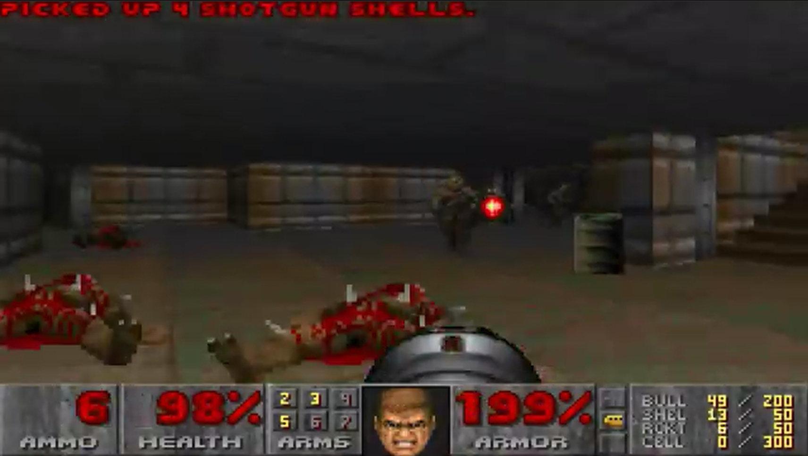

  The pipeline lives in `tools/video\_to\_frames.py`. It is a single script that goes from MP4 to a self-contained C file embedded in firmware. It has six stages.

  ### Stage 1 — Frame extraction

  I invoke `ffmpeg` with a downscale + framerate filter:

  ```
ffmpeg -i doom\_gameplay.mp4 -vf "fps=5,scale=128:64:flags=lanczos" frame\_%05d.png
```

  The source is 640×360 at 30 fps. The OLED is 128×64 at whatever framerate the flash budget will allow. I use Lanczos rescaling because it preserves more edge detail than bilinear, and DOOM is mostly edges.

  ### Stage 2 — Dithering to 1 bit per pixel

  The OLED has no greyscale. Every pixel is on or off. I support three dither modes:

|Mode|Quality|Compresses to|
|-|-|-|
|`threshold`|terrible mid-tones, sharp edges|smallest|
|`bayer` (default)|best quality/size tradeoff|small|
|`floyd`|best perceived quality|barely compresses|

I settled on Bayer for this project because it's the sweet spot. A 4×4 Bayer matrix is tiled across the frame:

```python
\_BAYER\_4 = np.array(\[
    \[ 0,  8,  2, 10],
    \[12,  4, 14,  6],
    \[ 3, 11,  1,  9],
    \[15,  7, 13,  5],
]) / 16.0
```

Each pixel's grey value is compared against its position in the Bayer tile. I added a `--gamma` knob (default 0.5) that brightens the source before quantization — DOOM is a dark game and the OLED has no headroom to recover crushed shadows. There is also a `--black-point` knob that says "anything below this brightness is solid black, no dither", which kills speckle in dark areas and helps the next stage compress harder.

### Stage 3 — Column-major OLED layout

This is the non-obvious step, and I want to spend a paragraph on it because it changes everything downstream.

The SSD1306 stores its framebuffer as 8 horizontal "pages", each 128 bytes wide. One byte = 8 *vertical* pixels in a column. The natural order to emit, page-major, is `page0\_col0, page0\_col1, ..., page0\_col127, page1\_col0, ...`.

But Bayer dithering produces *vertical* coherence: a single column of the source frame goes through a single column of the Bayer tile, and so within one column of the OLED, all 8 pages tend to share the same threshold and produce identical or near-identical bytes.

So I emit in **column-major** order instead: `col0\_page0..7, col1\_page0..7, ..., col127\_page0..7`. Now the redundant bytes are adjacent in the stream, which matters enormously for the next stage.

```python
buf = bytearray(BYTES\_PER\_FRAME)
for col in range(W):
    buf\[col\*8 : col\*8+8] = page\_bytes\[:, col].tobytes()
```

The firmware decompressor knows about this transposition and rearranges back into page-major layout while writing the framebuffer (see Stage 5).

### Stage 4 — RLE compression

A trivial run-length encoder, two bytes per run: `(count, value)`. Counts cap at 255.

```python
def rle\_compress(data):
    out = bytearray()
    i = 0
    while i < len(data):
        val = data\[i]
        run = 1
        while i + run < len(data) and data\[i + run] == val and run < 255:
            run += 1
        out.append(run)
        out.append(val)
        i += run
    return bytes(out)
```

Why RLE instead of a real compressor? Two reasons:

1. The decompressor must run on a Cortex-M0 with no LZ table memory. I have \~7 KB of RAM after the framebuffer; that is not enough room for an LZ window of meaningful size.
2. The column-major Bayer output has long runs of identical bytes in dark and bright regions — exactly the workload RLE excels at.

A typical raw OLED frame is 1024 bytes. After Bayer + column-major + RLE, mid-complexity DOOM frames land around 600–900 bytes; bright sky/wall regions can shrink under 200 bytes; the worst-case noisy frame is about 1.0–1.05× the raw size, capped at the budget.

### Stage 5 — C emission

The script writes a single self-contained `src/doom\_frames.c` containing:

* `frame\_data\[]` — concatenated RLE bytes for every frame
* `frame\_offsets\[]` — where each frame starts
* `frame\_lengths\[]` — how long each frame is
* `DOOM\_FRAME\_COUNT` and `DOOM\_FPS` constants
* A `DoomFrames\_Blit(uint32\_t idx)` function that decompresses one frame straight into the OLED framebuffer, transposing column-major back to page-major as it goes

The decompressor is the entire point and it's small enough to quote in full:

```c
void DoomFrames\_Blit(uint32\_t idx)
{
    const uint8\_t \*src = frame\_data + frame\_offsets\[idx];
    const uint8\_t \*end = src + frame\_lengths\[idx];
    uint8\_t \*fb = OLED\_Framebuffer();
    uint8\_t col = 0u, page = 0u;
    while (src < end) {
        uint8\_t count = \*src++;
        uint8\_t value = \*src++;
        do {
            fb\[(uint16\_t)page \* 128u + col] = value;
            if (++page == 8u) { page = 0u; ++col; }
        } while (--count);
    }
}
```

Two memory accesses per output byte, no buffering, and the column-to-page transposition happens implicitly via the `(page, col)` cursor. The cost is one multiply per byte, which on the Cortex-M0 is a single-cycle `MULS`. This was the moment I realized the Cortex-M0's tiny multiplier was actually carrying the whole project.

### Stage 6 — Build budget

The script accepts a `--budget` flag (default 48 KB). It greedily packs frames until the budget is exhausted, then stops and reports stats:

```
50 frames | 39214/49152 bytes (79%) | avg 784B/frame | 10.0s loop
```

For my demo build: **50 frames at 5 fps = 10-second loop**, fitting comfortably alongside the firmware in the 64 KB total flash. The firmware itself is \~50 KB; the frame table is the dominant tenant of `.rodata`.

\---

## Step 5 — Putting it on the screen

The main loop is anticlimactic, which I think is the right ending:

```c
int main(void)
{
    RCC\_AHBENR |= RCC\_AHBENR\_GPIOBEN;

    GPIO\_BSRR(GPIOB\_BASE) = (1u << OLED\_PIN\_PWR);   // PB14 HIGH first!
    gpio\_output\_pushpull(GPIOB\_BASE, OLED\_PIN\_PWR);

    delay\_ms(1000);                                  // OLED rail stabilize
    OLED\_Init();

    uint32\_t frame = 0u;
    while (1) {
        DoomFrames\_Blit(frame);
        OLED\_Update();
        delay\_ms(1000u / DOOM\_FPS);
        if (++frame >= DOOM\_FRAME\_COUNT) frame = 0u;
    }
}
```

That is the whole device. Power on, raise PB14, init the OLED, then loop forever drawing pre-decompressed DOOM frames.

\---

## Numbers

|Metric|Value|
|-|-|
|MCU|Geehy APM32F030C8T6, Cortex-M0, 48 MHz (PLL)|
|Flash|64 KB|
|RAM|8 KB|
|Display|128 × 64 monochrome OLED, SSD1306-compatible, bit-banged 4-wire SPI|
|Source video|DOOM gameplay, 640×360 @ 30 fps, 60 s|
|Encoded loop|128 × 64 @ 5 fps, 50 frames, \~10 s|
|Frame storage|RLE-compressed Bayer-dithered 1bpp, column-major|
|Total firmware|50,928 B `.text/.rodata`, 1,024 B `.bss` (the framebuffer)|
|External components|none — no SD card, no PSRAM, no extra ICs|

\---

## Closing thoughts

This walkthrough has lots of different ways to repurpose a cheap medical gadget, and DOOM is just the demo I picked because it is the universal "did you really get it running?" test. You can use any method from here, or one I haven't explored, to push your own content onto the OLED — that's the whole point of hacking on hardware: finding creative ways to make a device do something it was never intended to do.

If you have a drawer full of dead or unloved gadgets, my recommendation is to pick the one with the nicest screen and the most over-specced MCU, wipe it, and see what you can do. The hard parts — the booby-trapped power-enable pin, the always-selected SPI slave, the bit-banged clock — are also the parts that teach you the most.

Source, captures, the video pipeline, and the firmware all live in this repository. Have fun.

